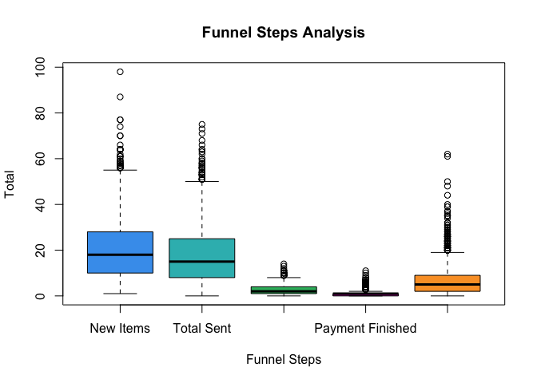
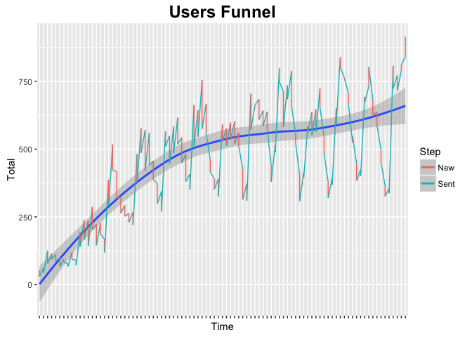
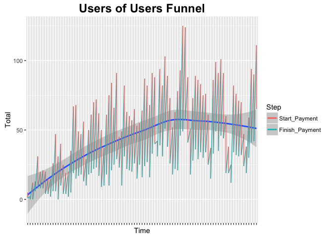
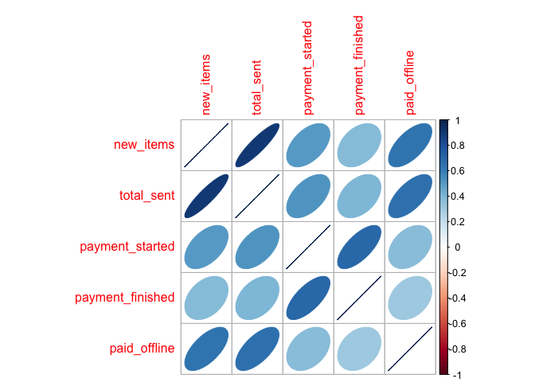
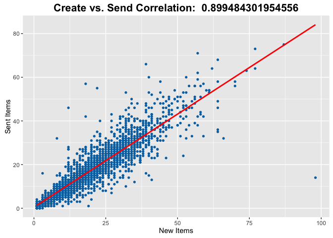
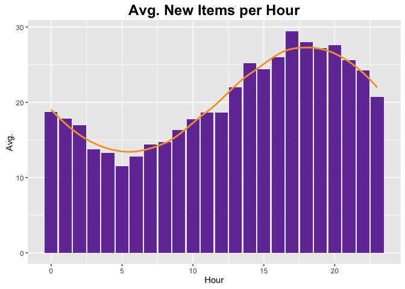
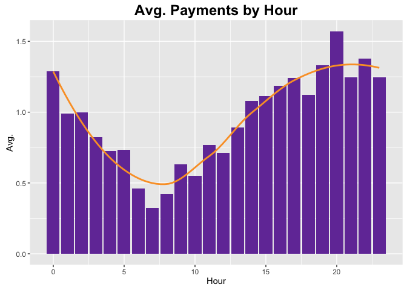

# Funnel Analysis
In this report we will analyze the funnel of a SaaS product which enables the users to send payment requests to their users, and get paid online and offline.

***Conversion funnel*** is a phrase used in e-commerce to describe the journey a consumer takes through an Internet advertising or search system, navigating an e-commerce website and finally converting to a sale. The metaphor of a funnel is used to describe the decrease in numbers that occurs at each step of the process. [Wikipedia]*

### Funnel Steps
1. Create payment request.
2. Send payment request to a customer.
3. customer (aka **user of user**) pays online or offline.

## Analysis

### Step 1: Gathering the Data
At first, the data (csv-file) is downloaded from the web, and get loaded into the environment, as `funnel` value.

```r
# Download dataset
datasetFile <- "funnel_data.csv"
datasetUrl <- "https://raw.githubusercontent.com/lidanh/data-science-exploration/master/funnel_data.csv"

if (file.exists(datasetFile)) {
  file.remove(datasetFile)
}
```

```
## [1] TRUE
```

```r
download.file(datasetUrl, destfile = datasetFile, method = "curl")
```


```r
funnel <- read.csv(datasetFile)
```

### Step 2: Basic Exploration
We'll start with a basic exploration in order to understand the dataset: columns, data types, dataset size, etc.

```r
summary(funnel)
```

```
##          date           hour        new_items       total_sent   
##  2016-01-05:  24   Min.   : 0.0   Min.   : 1.00   Min.   : 0.00  
##  2016-01-06:  24   1st Qu.: 5.5   1st Qu.:10.00   1st Qu.: 8.00  
##  2016-01-09:  24   Median :12.0   Median :18.00   Median :15.00  
##  2016-01-10:  24   Mean   :11.5   Mean   :20.24   Mean   :17.75  
##  2016-01-11:  24   3rd Qu.:17.5   3rd Qu.:28.00   3rd Qu.:25.00  
##  2016-01-12:  24   Max.   :23.0   Max.   :98.00   Max.   :75.00  
##  (Other)   :2027                                                 
##  payment_started  payment_finished   paid_offline   
##  Min.   : 0.000   Min.   : 0.0000   Min.   : 0.000  
##  1st Qu.: 1.000   1st Qu.: 0.0000   1st Qu.: 2.000  
##  Median : 2.000   Median : 1.0000   Median : 5.000  
##  Mean   : 2.564   Mean   : 0.9516   Mean   : 6.626  
##  3rd Qu.: 4.000   3rd Qu.: 1.0000   3rd Qu.: 9.000  
##  Max.   :14.000   Max.   :11.0000   Max.   :62.000  
## 
```

We can see that there are **2027** observations, with 7 columns- date, hour, and 5 funnel steps:

- **date** (as date type)
- **hour** (number between 0 to 23)
- **new_items** (number between 1 to 98, with avg. of 20.24 and median of 18)
- **total_sent** (number between 0 to 75)
- **payment_started** (number between 0 to 14)
- **payment_finished** (number between 0 to 11)
- **paid_offline** (number between 0 to 62)

Based on this summary we can't understand if those number are users (that have done a given step) or items.

let's see the first items in this dataset:

```r
head(funnel)
```

```
##         date hour new_items total_sent payment_started payment_finished
## 1 2016-03-31   23        42         48               5                5
## 2 2016-03-31   22        51         51               6                3
## 3 2016-03-31   21        44         53               7                2
## 4 2016-03-31   20        54         56              10                6
## 5 2016-03-31   19        45         46              10                6
## 6 2016-03-31   18        58         51               7                3
##   paid_offline
## 1           35
## 2           26
## 3           22
## 4           14
## 5           18
## 6           12
```

We can see that each observation describes the funnel in a given hour.

Based on this summary, we can plot the following boxplot graph of the funnel steps:

```r
boxplot(funnel$new_items, 
        funnel$total_sent, 
        funnel$payment_started, 
        funnel$payment_finished, 
        funnel$paid_offline, 
        main="Funnel Steps Analysis",
        ylab ="Total", xlab ="Funnel Steps",
        names = c("New Items", "Total Sent", "Payment Started", "Payment Finished", "Paid Offline"),
        col = c("#459fed", "#32babc", "#32b76c", "#a0138e", "#faa030"))
```



From this graph we can see that there are considerably less payments than created and sent payment requests, which can indicate a conversion problem in the funnel.
We can also see that the range of the new items is very similar to sent items, which means that this step's conversion looks good, and we will explore it deeper later in this report.

### Step 3: Visualizing the Funnel
How does this product's funnel behaves over time?

We have two main flows: **user flow** (create request and send it to a customer) and **user of user** flow (making a payment, either online or offline).
Using the following function, we will visualize both of those flows of the funnel over time.
For simplicity we will aggregate the data by day instead of hour using `sum` function.

```r
visualize_funnel <- function(title, steps) {
  # Aggregate the data per day instead of per hour for better visualization.
  total_by_day <- aggregate(steps, by = list(Date = funnel$date), FUN = sum)
  
  # Optimize the data for this kind of plots using reshape2 library
  melted_totals <- melt(total_by_day, id = "Date", variable.name = "Step")
  
  # Plot
  ggplot(melted_totals, aes(x = Date, y = value, colour=Step, group = 1)) + 
    geom_smooth() +
    geom_line() +
    ylab(label="Total") + 
    xlab("Time") +
    ggtitle(title) +
    theme(
      axis.text.x=element_blank(), 
      plot.title = element_text(size=18, face="bold"))
}
```


```r
# Users funnel: new + sent
visualize_funnel("Users Funnel", list(New = funnel$new_items, Sent = funnel$total_sent))
```



- Both of the lines have some "waves". This fact indicates that the users create and send less payment requests in the weekend, while each wave is a week, and there are "hotter" days than others.  This conclusion makes sense, given the fact that this product is intended for businesses.
- The trendline is positive, indicating that the product is growing, **which is great!**
- Again, the lines converge, which means that the conversion from "create" step to "send" step is almost 100%. As mentioned earlier, we will explore this hypothesis soon.


```r
# UoU funnel: start pay + finish pay
visualize_funnel("Users of Users Funnel", list(Start_Payment = funnel$payment_started, Finish_Payment = funnel$payment_finished))
```


- Also here the trendline is positive until a certain point and then it becomes negative. This fact indicates that there is a small problem in this funnel, which needs some improvements.


### Step 4: Find Correlations
Now we would like to find correlations between features, in order to understand the importance of each feature (aka funnel step), and how each feature affects the whole funnel.
We do that by using `corrplot` library, which visualizes correlations with ellipses. The ellipse direction means positive/negative correlation, the size and color mean how correlated the features are.

```r
library(corrplot)

# calculate correlations matrix
M <- cor(subset(funnel, select = c("new_items", "total_sent", "payment_started", "payment_finished", "paid_offline")))

# visualize this matrix using corrplot library
corrplot(M, method = "ellipse")
```



We can clearly see that the highest correlation is between new items (create payment request) and sent items (send payment request to customer), which confirms the hypothesis we mentioned here.
We can also see that there is strong correlation between *payment started* step and *payment finished* step, but weak positive correlation between new items and items that got paid successfully (payment finished step), which, again, might be a problem in this funnel.

### Step 5: New-Sent Correlation
So the last plot confirmed that there is a strong positive correlation between new items and sent items, but how strong it is?
Using `cor` function we will calculate the correlation of those features, and create a scatter plot with linear trendline.

```r
# calc correlation
users_funnel_corr <- cor(funnel$new_items, funnel$total_sent)
```

```r
# plot
ggplot(funnel, aes(x = new_items, y = total_sent, group = 1)) +
  geom_point(shape=16, color = "#0072B2") +
  geom_smooth(method=lm, se=FALSE, color="red", formula = y ~ x) +
  ylab(label="Sent Items") + 
  xlab("New Items") +
  ggtitle(paste("Create vs. Send Correlation: ", users_funnel_corr)) +
  theme(plot.title = element_text(size=16, face="bold"))
```



This is amazing!  The correlation coefficient (explained variance) is **0.89**, which means that most of the users who create payment requests, also send it to their customers.

### Step 6: Avg. a given step per hour
We would like to schedule a maintanence, or release a new feature to our customers. what is the best hour to do that?
In this step we will take two funnel steps, aggregate each one of them by hour, and see how many events of each funnel step happens, in average, every hour.

Firstly, we'll create a function that calculates this data and creates a bar plot.


```r
avg_by_hour <- function(title, steps) {
  # aggregate the events by hour (function is avg)
  avg_by_hour_value <- aggregate(steps, by = list(Hour = funnel$hour), FUN = mean)
  
  # Optimize the data for this kind of plots using reshape2 library
  melted_totals <- melt(avg_by_hour_value, id = "Hour", variable.name = "Step", stat="identity")
  
  # Plot
  ggplot(melted_totals, aes(x = Hour, y = value)) + 
    geom_bar(stat="identity", fill="#733ca6") +
    ylab(label="Avg.") + 
    xlab("Hour") +
    ggtitle(title) +
    stat_smooth(color = "#faa030", se=FALSE) + 
    theme(plot.title = element_text(size=18, face="bold"))
}
```

**Users funnel**: How many payment requests are created successfully every hour, in average?

```r
avg_by_hour("Avg. New Items by Hour", funnel$new_items)
```



**Users of users funnel:** How many payments, in average, are finished successfully every hour of the day?

```r
avg_by_hour("Avg. Payments by Hour", funnel$payment_finished)
```



Based on those graphs and the trendlines we can conclude that the hottest time is around the evening (5pm-6pm), while the lowest-traffic time is around the morning (5am-7am).


## Summary, Conclusions and Recommendations
In this assignment we've experiences gathering data from a structured file (csv format), understanding it and inferring some insights about it, based on some visualizations which make the process easier.

### Conclusions
One of the most interesting graphs is the correlations graph, which indicates some conversion problems in this funnel.  Also, the "funnel over time" graph is very important, because it can show celarly if this product is growing or not, based on the positiveness of the trendline.

This research can help analysts and product managers to optimize the product funnel, and improve the value proposition of this product which finally may increase the profits.

### Recommendations
- **Always** try to optimize the funnel (most of the time using A/B tests) according to the insights, and **measure everything!**
- Calculate the conversion rate between steps- totals, daily and hourly.
- Investigate the decrease in users of users funnel (payments).
- Try to understand what are the problems in the payment process, which leads to medium conversion rate between start and finish payment process.
- Using more data sources, calculate the [retention rate](https://en.wikipedia.org/wiki/Retention_rate) of this product- how many users use this product on a daily basis, for example.
- Using more datasources, measure those metrics again- but for users instead of items.  What is the average payment requests total?
